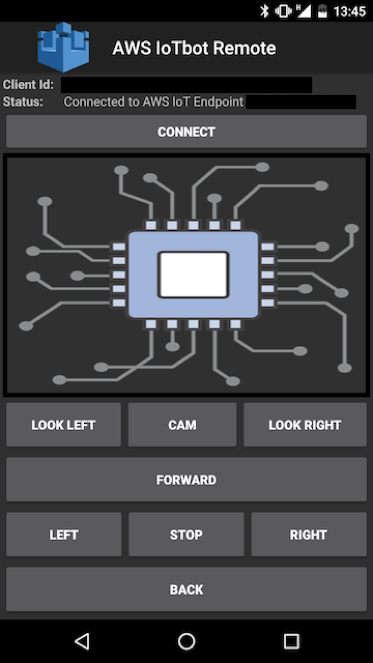

<p align="center">
  
</p>

This is an android app that controls the IoTbot: https://github.com/awsed/iotbot

The app controls the robot movements via AWS IoT as well as retrieves the images taken by the robot camera from an S3 bucket.

You'll need a S3 bucket and a Cognito Unatuthenticated Role with the following Inline Policy:

```
{
    "Version": "2012-10-17",
    "Statement": [
        {
            "Effect": "Allow",
            "Action": [
                "mobileanalytics:PutEvents",
                "cognito-sync:*"
            ],
            "Resource": [
                "*"
            ]
        },
        {
            "Effect": "Allow",
            "Action": [
                "s3:GetObject",
                "s3:PutObject"
            ],
            "Resource": [
                "arn:aws:s3:::<bucket>/*",
                "arn:aws:s3:::<bucket>"
            ]
        }
    ]
}
```

And the AWSIoTFullAccess policy attached as Managed Policy. The Trust Relashionships should be:

```
{
  "Version": "2012-10-17",
  "Statement": [
    {
      "Effect": "Allow",
      "Principal": {
        "Service": "iot.amazonaws.com"
      },
      "Action": "sts:AssumeRole"
    },
    {
      "Effect": "Allow",
      "Principal": {
        "Federated": "cognito-identity.amazonaws.com"
      },
      "Action": "sts:AssumeRoleWithWebIdentity",
      "Condition": {
        "StringEquals": {
          "cognito-identity.amazonaws.com:aud": "<Identity Pool>"
        },
        "ForAnyValue:StringLike": {
          "cognito-identity.amazonaws.com:amr": "unauthenticated"
        }
      }
    }
  ]
}
```

After executing the app for the first time and clicking on the CONNECT button, a new certificate will be created on the AWS IoT console (https://console.aws.amazon.com/iot/home). The certificate needs to be attached with the IoT thing and the IoT policy. 
